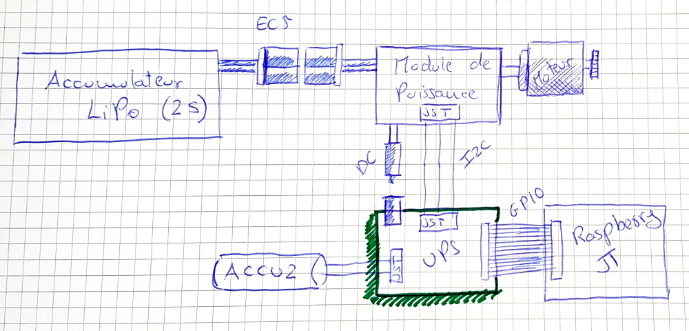
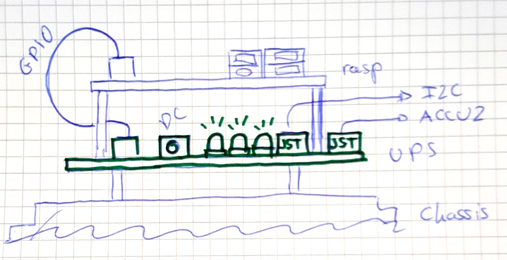

# Introduction

## Objectifs
Ce module sert à embarquer un Raspberry Pi dans un modèle réduit, et pourvoir à:

* L'alimenter correctement: 5V, 2A
* Prévenir des coupures de courant intempestives. Le module peut utiliser un accumulateur secondaire si jamais le principal se décharge.
* Offrir des prises standard pour:
  * Entrée principale de courant.
  * Connexion d'un accumulateur secondaire.
  * Connexion I2C.
 
## Vue d'ensemble
L'accumulateur principal est connecté à un module de puissance, qui s'occupe normalement de gérer un moteur, des servos, etc. Le module de puissance offre une prise de courant non régulé, provenant directement de l'accumulateur.  Le module de puissance offre également un accès au bus I2C via un connecteur JST à trois broches. Le module UPS est connecté au GPIO du Raspberry au moyen d'une nape de 40 connecteurs.

Le module UPS est fixé sous le Raspberry avec 4 visses et entretoises.

## Scénario d'utilisation
1. Le module UPS utilise l'alimentation, provenante d'un accumulateur principal bien chargé, pour fournir le Raspberry avec une tension de 5V et un courant de 2A ou moins.
2. Le module UPS utilise l'alimentation pour charger l'accumulateur secondaire.
3. Le module UPS cesse de charger l'accumulateur secondaire lorsque celui-ci est suffisamment chargé.
4. L'alimentation baisse au fur et à mesure que l'accumulateur principal se décharge. Le module UPS fournit le Raspberry avec une tension constante de 5V.
5. L'alimentation défaille, car l'accumulateur principal est dangeureusement déchargé. Le module UPS sollicite l'accumulateur secondaire pour fournir le Raspberry avec une tension constante de 5V et un courant de 2A ou moins.
6. Le raspberry, interrogeant régulièrement le module UPS, trouve le moment de s'éteindre.
7. Le module UPS détecte que le Raspberry s'est éteint, et se désactive lui-même.
8. L'utilisateur remplace l'accumulateur principal. Lorsque l'alimentation est à nouveau disponible, le Raspberry s'allume.

# Contraintes fonctionnelles
Voici la liste des contraintes fonctionnelles répertoriées jusqu'à présent.

## U010 - Alimenter le Raspberry à partir de l'alimentation principale
C'est la fonctionnalité principale du module.

## U020 - Charger l'accumulateur secondaire à partir de l'alimentation principale.
Le module UPS surveille les niveaux de tension de sortie de l'accumulateur secondaire, et le met à la charge 

## U030 - Alimenter le Raspberry à partir de l'accumulateur secondaire.
Le module UPS offre une alimentation inintérrompue; si l'alimentation principale défaille, le module sollicite l'accumulateur secondaire.

## U040 - Détecter que le raspberry s'est éteint
Le cas échéant, le module UPS peut isoler le Rasperry de l'alimentation principale et de l'accumulateur secondaire.

## U050 - Donner au raspberry des informations à propos des niveaux de charge
Pour que le raspberry ait une chance de s'éteindre proprement avant de manquer de courant, il peut interroger le module UPS pour récupérer:

* Le niveau de l'alimentation principale.
* Le niveau de l'accumulateur secondaire.

## U060 - Faciliter la connexion I2C entre le Raspberry et d'autres modules.
Puisque le module UPS est branché sur le Raspberry via 

## U070 - Indiquer l'état du module par des voyants lumineux.
Utiliser 3 LED de couleurs pour ceci. Les LED sont facilement visibles.

# Contraintes techniques

## T010 - Modèle de Raspberry
Le module est prévu initialement pour un Raspberry 2 B

## T020 - Alimentation principale LiPo 2s
L'alimentation principale est fournie par un accumulateur de type LiPo 2S. Le module UPS:

* Supporte le niveau de charge maximum de ce type d'accumulateur.
* Ne consomme pas d'alimentation si le niveau de charge tombe en dessous du minimum.

## T030 - Pas de transfert entre l'UPS et l'alimentation
Le module UPS ne doit jamais transférer du courant vers l'alimentation principale. Celle ci étant fournie par un accumulateur de type LiPo, suivant les conditions elle pourrait réagir de façon catastrophique.

## T040 - Accumulateur secondaire Li-Ion Sony US18650VTC5A
Par exemple: http://www.conrad.ch/ce/fr/product/1499575
Le module UPS protège l'accumulateur contre:

* La surchage.
* Le courtcircuit.
* La décharge excessive.
* Dans la mesure du possible, une surabondance de cycles de charge.

## T050 - Le Raspberry PI peut se visser sur le module UPS
Le module UPS offre des fixations pour permettre de visser le Raspberry dessus. Le module a une taille maximum de 95mm x 70mm

## T060 - La seule connexion entre le Raspberry PI et le module UPS est le GPIO.
Le GPIO contient tous les connecteurs nécessaires. Nous n'en voulons aucun autre.

## T070 - Les différentes prises, voyants et actionneurs sont accessibles
Le Raspberry se vissant au dessus du module, ceci implique probablement que les différents éléments de connexion se trouvent proches d'un des bords du module.

## T080 - Le Raspberry communique avec le module UPS en I2C
Parce que Raspberry supporte facilement ce protocole, et parce qu'il est prévu de l'utiliser également pour communiquer avec le module de puissance.

## T090 - La construction du module est accessible à des amateurs
Car les utilisateurs de ce module sont des modélistes, avec une certaine habileté manuelle, mais pas de connaissances précises en électronique:
* Le bus I2C et l'accumulateur sont branchés avec des JST de 2.5mm de pas.
* L'alimentation est branchée sur un connecteur DC coaxial.
* Il n'y a pas deux prises interchangeables. Il n'est pas possible de se tromper de polarité.
* Les composants électroniques sont traversants, d'une taille manipulable par des non-professionnels.

## T100 - La BOM est disponible chez Conrad.ch
Car ce fournisseur propose également un catalogue de modélisme.
